# Cognitive Services meets Power Apps Hackathon

This tutorial will guide you through two scenario's:
- The first one will guide you step-by-step through the process of building a Power App infused by AI to familiarize yourself with Power Apps
- The second one will show you how to deploy resources in Azure, train your own Custom Vision model and integrate it in any application

## Power Apps

Power Apps is a suite of apps, services, connectors and data platform that provides a rapid application development environment to build custom apps for your business needs. Using Power Apps, you can quickly build custom business apps that connect to your business data stored either in the underlying data platform (Common Data Service) or in various online and on-premises data sources (SharePoint, Excel, Office 365, Dynamics 365, SQL Server, and so on).

Apps built using Power Apps provide rich business logic and workflow capabilities to transform your manual business processes to digital, automated processes. Further, apps built using Power Apps have a responsive design, and can run seamlessly in browser or on mobile devices (phone or tablet). Power Apps "democratizes" the custom business app building experience by enabling users to build feature-rich, custom business apps without writing code.

Power Apps also provides an extensible platform that lets pro developers programmatically interact with data and metadata, apply business logic, create custom connectors, and integrate with external data.
(For detailed documentation see [here](https://docs.microsoft.com/en-us/powerapps/powerapps-overview))

## Scenario 1: Form Processing with Power Apps

Form processing identifies the structure of your documents based on examples you provide to extract text from any matching form. Examples might include tax forms or invoices.

In this lab we will build and train a model for recognizing invoices. Then we will build a tablet app to show the detection in action and digitize the content.

Navigate to the [Power Apps Homepage](https://powerapps.microsoft.com/en-us/) and sign in with the credentials we have provided.

Once you've signed in click on "AI Builder" then "Build" on the left hand side.
Since this is your first time using Power Apps you'll have to create a new environment & add a database first - click on the corresponding button in the middle of the page and just follow the instructions.

Once that is done, you should see this view in the AI Builder - Build Tab:

Click on Form Processing, choose a name for your AI model and hit the Create button.
Your screen should look like the following image:

We have prepared some sample invoices for you. You can find these documents [here](../FormProcessing_Invoices.zip). Select Add documents and add the documents from the Train folder. 
You must have at least five documents to train the model.
Confirm the selection and click Upload.

Once your uploads are complete, select Analyze:

Select the fields:  

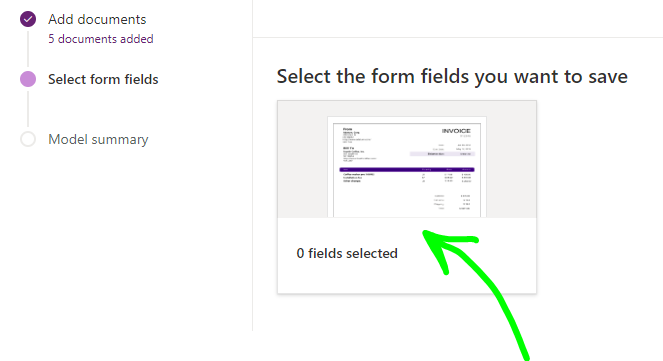
Hover over the highlighted fields and confirm the fields that should be returned by the form when processing from our trained model.

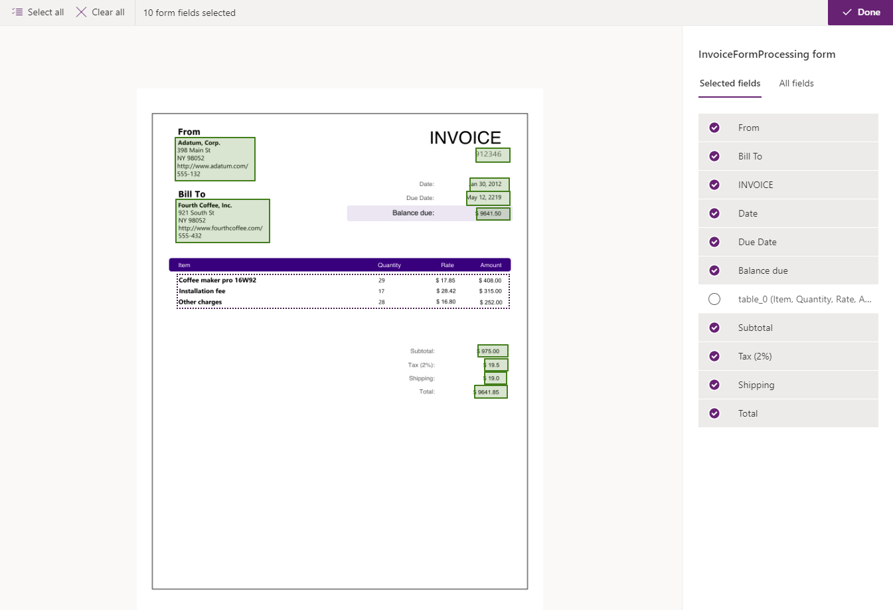

Once you have confirmed the fields, click Done.
Then click next to get to the Model summary page. Here click on Train to start model training.
You'll be prompted to Go to the Details page once the training is completed.

If you click on Quick test you can upload an image from the test folder to perform a test of your model.

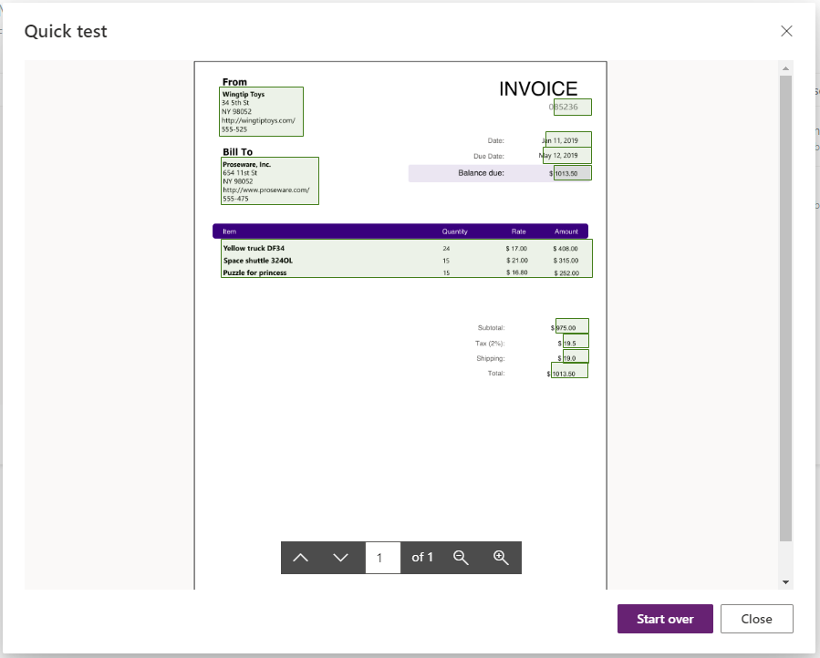

You can also perform a test with another image if you like.
Once you're satisfied with the result click on Publish to publish your model.

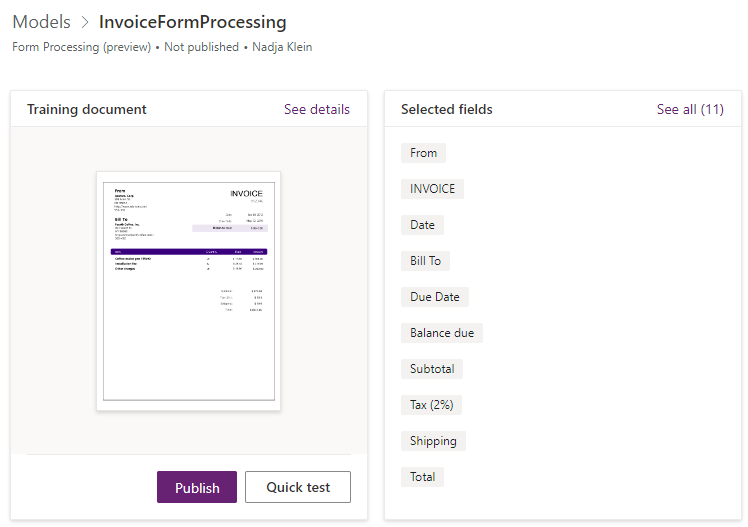

Now that we've published the model it's time to implement it into a Power App. Therefore navigate to Apps on the left hand side and create a new Canvas App. Select Blank app with a tablet layout.

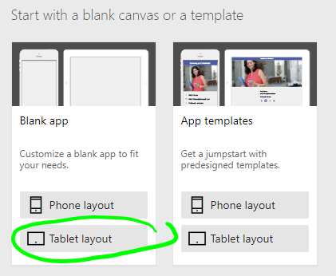

Insert the Form Processor control from the AI Builder.

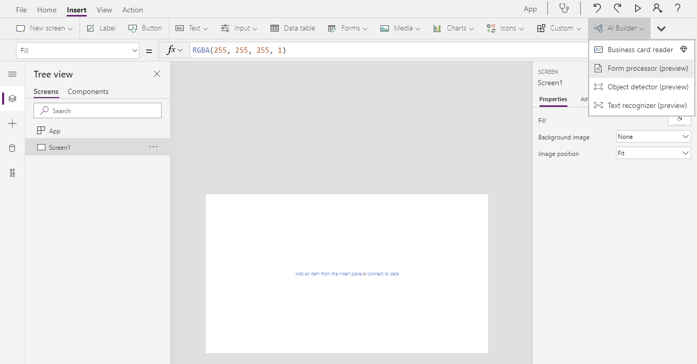

Map it to your saved model.

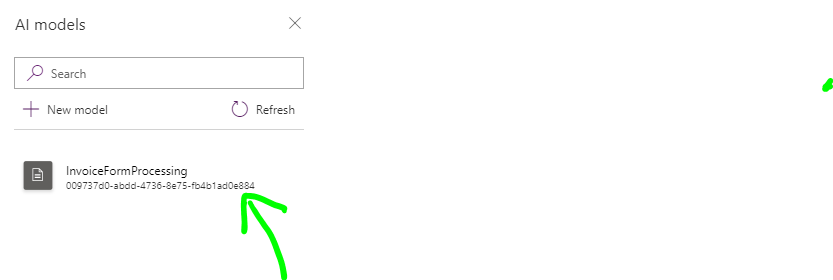

Drag and resize the control like the image below, then play your app.

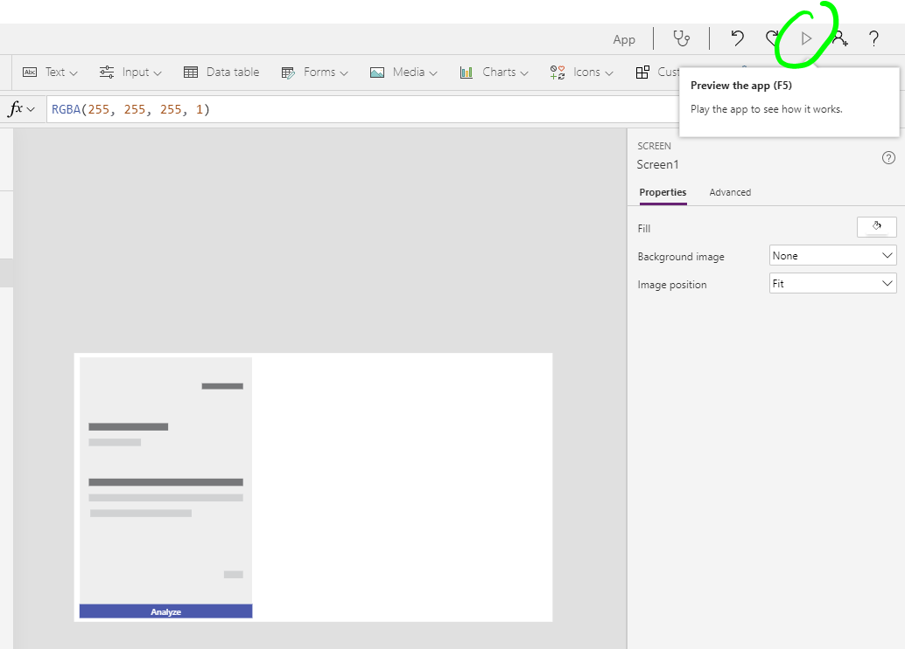

Click Analyze and add your test file. Your uploaded form will be analyzed and you can see the mapped fields are recognized. Close the app player.

Let's take some of the data fields and place them on the screen for the user to review.
Add three labels to the screen. Drag them to the right side of the screen and line them up like in the image below. Edit the text to "Invoice Number", "Due Date" and "Total".

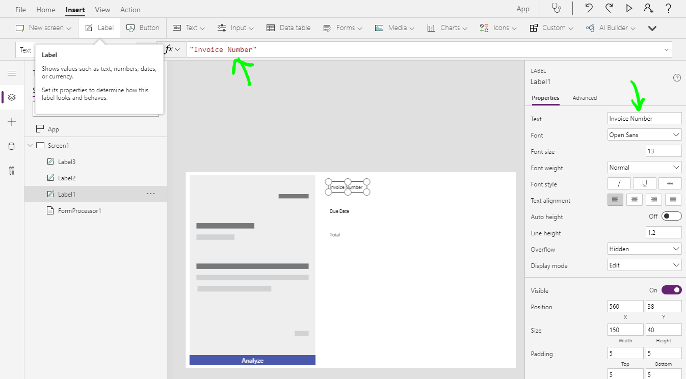

Add Text input fields for each row and place them next to the labels.
Now we will map data from the analyzed document. Edit the default values for each field as follows:

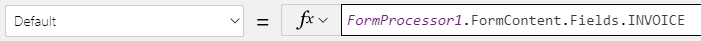
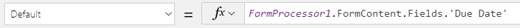
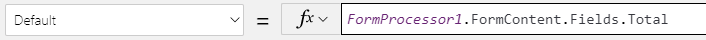

Play the app and add an invoice to be analyzed.
You can of course add additional fields as well, please feel free to play around with different options.

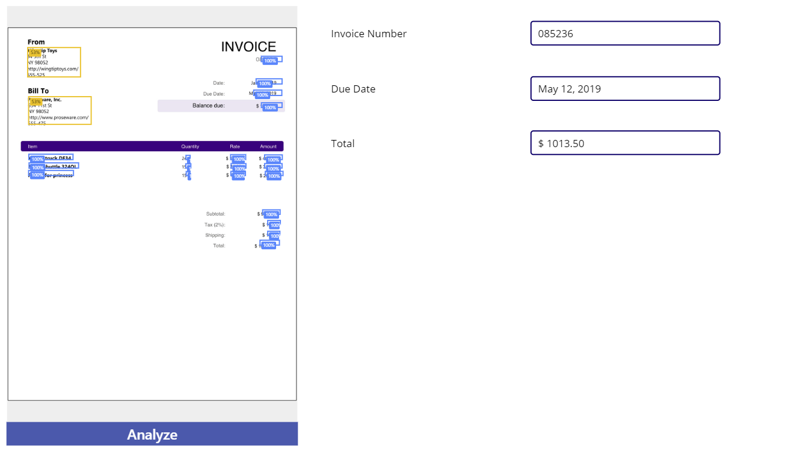
