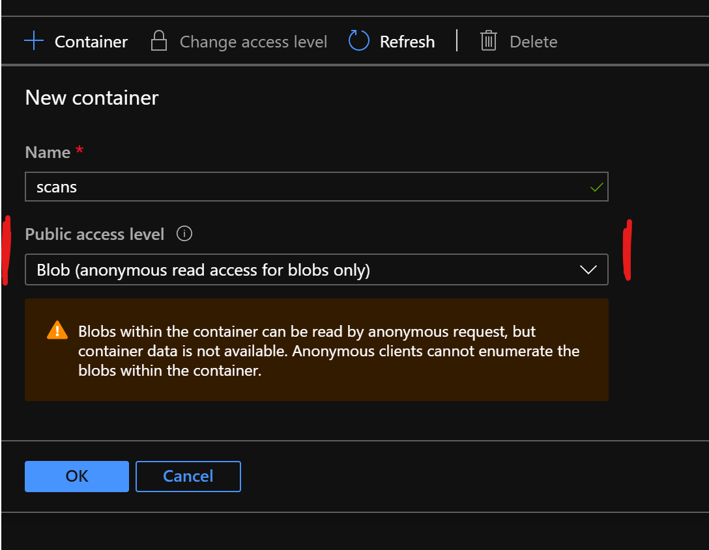
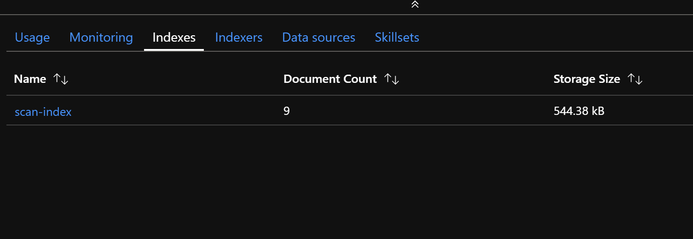
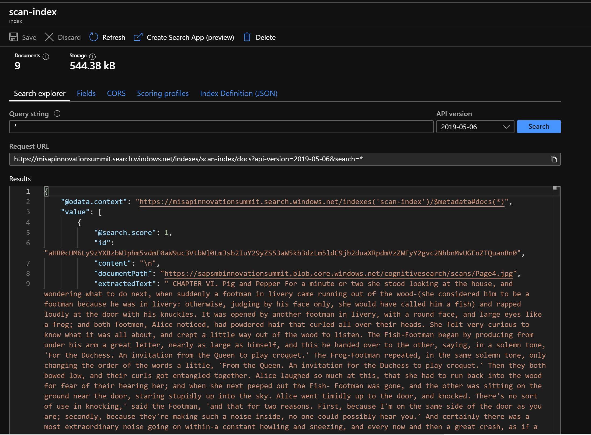
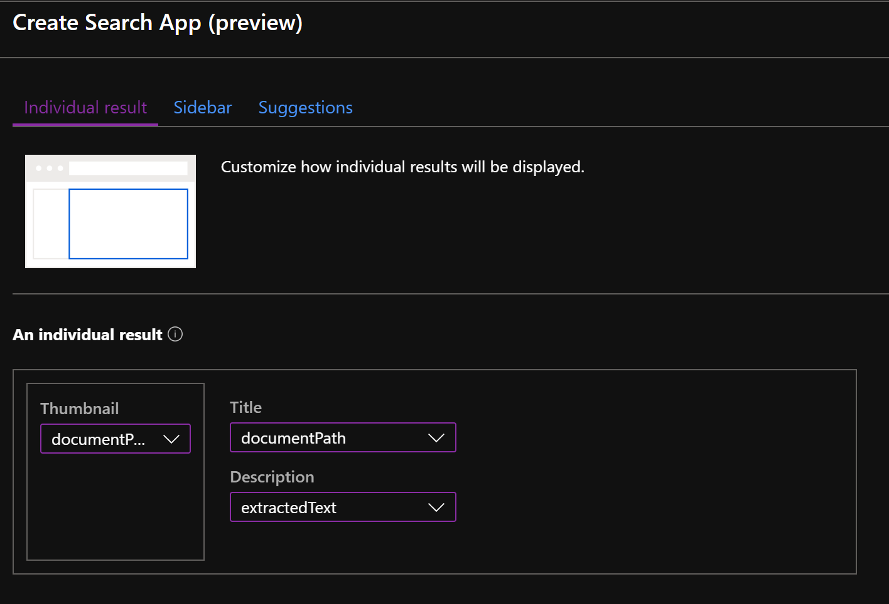
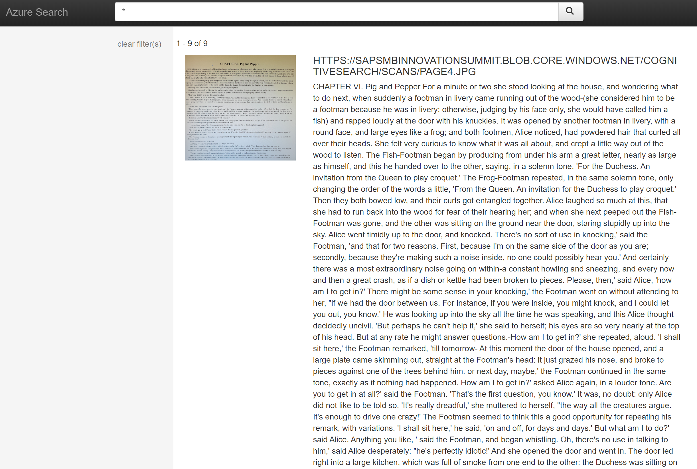

# Knowledge Mining with Azure Cognitive Search

[Azure Cognitive Search](https://azure.microsoft.com/en-us/services/search/) (formerly known as "Azure Search") is a search-as-a-service cloud solution that gives developers APIs and tools for adding a rich search experience over private, heterogeneous content in web, mobile, and enterprise applications. Your code or a tool invokes data ingestion (indexing) to create and load an index. Optionally, you can add cognitive skills to apply AI processes during indexing. Doing so can add new information and structures useful for search and other scenarios.

In this scenario, we will use it's built-in AI capabilities to enrich and index unstructured data such as images, documents, etc. The use-case behind that scenario is that many companies struggle to identitify and (internally and externally) provide knowledge that is hidden in large collections of documents with its content hard to access from the outside and almost impossible to search with a consolidated knowledge base. Imaging a search machine such as Bing or Google on top of your documents.

While it might be easy to extract text from a Word document and make it searchable, the harder part typically is to enrich raw or binary information with usefull data such as:
- What objects are on images, what persons, locations, etc.?
- What text is on scans of paper documents, in what language is it writtern and what are the key phrases?
- Where did the employee that left the company 2 years ago store the instructions on how to defuse the bomb in the kitchen (we certainly need to cut the red wire, right)?

To answer these questions, we will build a AI pipeline on a set of documents to enrich them and create searchable metadata. Eventually we will provide this information on a simple website with a convenient search interface.

Lets get started!

## Create a search service instance and familiarize yourself with Azure Cognitive Search

At a first step, we will setup the basis components we will use to build the solution. For that, follow the instructions provided [here](https://docs.microsoft.com/en-us/azure/search/cognitive-search-tutorial-blob-python). This is a Microsoft provided step-by-step-guide for a basic document cracking and enrichment process. 

<strong>Note that this scenario is using Python to call the REST-API directly to create all artifacts in Azure search. Although there is a UI available in the Azure Portal, it is rather limited and we will need the REST-API for subsequent steps anyway as we will implement a more complex scenario. </strong>

These instructions include that you setup your own Jupyter notebook environment. That is okay, but there is even an easier way to get things done:

Navigate to [Azure Notebooks](https://notebooks.azure.com) to find a Microsoft hostet Jupyter environment. Login with your AAD credentials and start without a local software installation. The sample notebook can be downloaded from this [Github Repo](https://github.com/Azure-Samples/azure-search-python-samples/blob/master/Tutorial-AI-Enrichment/PythonTutorial-AzureSearch-AIEnrichment.ipynb).

Basically this covers the following steps:
1. Create a data source. That is the connection to actual data hosted on Azure, in this particular case, Azure blob storage (since we are dealing with unstructured document data).
2. Create a [skillset](https://docs.microsoft.com/en-us/rest/api/searchservice/skillset-operations). That is the processing chain that enriches the raw data. A skillset contains one or more skills that have inputs and outputs and can be chained together. 
3. Create an [index](https://docs.microsoft.com/en-us/rest/api/searchservice/index-operations). That defines the form and shape of your index, that consists of (potentially nested) fields that have certain properties and a datatype.
4. Create an [indexer](https://docs.microsoft.com/en-us/rest/api/searchservice/indexer-operations). That is the "loader" of the data taking it from the source, push it through the enrichment pipline (optinionally) and load it to the index. 

After finishing that tutorial, you should have a basic understanding how Azure Cognitive Search works and have most of the required Azure services up and running. 

Now, we will build something more sophisticated.

## Build our own pipeline for indexing texts from book scans

So this scenario is about getting content out of book pages that have been scanned and saved as .JPG files. To get knowledge out of that scans, we will 
- run a OCR job (optical character recognition) on the images 
- determine the language of the text
- extract key phrases
- translate text into your favorite language
- push it to an index and make it searchable
- create a simple website that serves as an UI to run search queries

Ready? Let's go.

Ah, wait. One more thing: We will provide a solution to that scenario, it is available as a Jupyter notebook [here](./Annex/KnowledgeMiningSolution.ipynb). But just copy & paste our code is considered cheating. So use with caution. 
#### Data preparation

1. Download the scans from [this URL](https://sapsmbinnovationsummit.blob.core.windows.net/samples/Scans.zip) and extract them on your machine. 

2. In the first exercise, you created a storage account and a container within it. Create a new container (using the Azure Portal or a different tool) and set access level to "Public - Blob".

<strong>You need to be careful with that setting as this is one of the main reasons why data is lost. Everybody knowing the URLs to the blobs can access them now, which is fine in our case and has a particular reason. NEVER set this configuration for confidential data!</strong>

3. Upload the previsously downloaded data to the container. You may create a folder within the container, but remember that later!

#### Build your pipeline

Now, we will create our pipeline similiar to the first exercise. So, we will need to 

1. Create a new data source. We cannot use the existing one because we created a new container. Remember to configure a subfolder if you uploaded the scans to one. That is done with a "query" attribute:
<code>"container": {
      "name": "scans",
      "query": "yoursubfolder"
   }</code>

2. Create your skillset. I assume that this is a tricky task, espically the field mappings need to be set up carefully. We want to do the following enrichments:
    1. ORC on the image. This will output an <strong>array</strong> of text because you may have multiple components on your image. See [this link](https://docs.microsoft.com/en-us/azure/search/cognitive-search-skill-ocr) how to use that skill. It provided also an example how to chain multiple skills together.
    2. Merge the array of text to a single attribute (you'll need [this](https://docs.microsoft.com/en-us/azure/search/cognitive-search-skill-textmerger) skill)
    3. Detect the [language](https://docs.microsoft.com/en-us/azure/search/cognitive-search-skill-language-detection) of the text.
    4. Extract [key phrases](https://docs.microsoft.com/en-us/azure/search/cognitive-search-skill-keyphrases) from the text. You'll need to set the language accordingly.
    5. [Translate](https://docs.microsoft.com/en-us/azure/search/cognitive-search-skill-text-translation) the text into your favourite language.

#### Create the index. 
If you did everything that was required above, your index might look like this:

<code>{
    "name": index_name,
    "fields": [
      {
        "name": "id",
        "type": "Edm.String",
        "key": "true",
        "searchable": "true",
        "filterable": "false",
        "facetable": "false",
        "sortable": "true"
      },
      {
        "name": "content",
        "type": "Edm.String",
        "sortable": "false",
        "searchable": "true",
        "filterable": "false",
        "facetable": "false"
      },
      {
        "name": "documentPath",
        "type": "Edm.String",
        "searchable": "true",
        "filterable": "false",
        "facetable": "false"
      },
            {
        "name": "extractedText",
        "type": "Edm.String",
        "searchable": "true",
        "filterable": "false",
        "facetable": "false"
      },
      {
        "name": "languageCode",
        "type": "Edm.String",
        "searchable": "true",
        "filterable": "false",
        "facetable": "false"
      },
      {
        "name": "keyPhrases",
        "type": "Collection(Edm.String)",
        "searchable": "true",
        "filterable": "false",
        "facetable": "false"
      },
      {
        "name": "translatedText",
        "type": "Edm.String",
        "searchable": "true",
        "filterable": "false",
        "facetable": "false"
      }
    ]} 
</code>

<strong>Azure Congitive Search provides built-in access to Cognitive Services, that will do all the AI-related tasks. You can rely on those...but even better bring your own instance of Cognitive Services. With that, you are not limited to a certain amount of documents and features. See [here](https://docs.microsoft.com/en-us/azure/search/cognitive-search-attach-cognitive-services) how to set this up.  </strong>

#### Create the indexer.
That is a bit tricky as well, at least for the first time. You'll need to map the output from your skillset to attributes of your index. Addtionally, the indexer is the component that actually runs once or periodically. Set this up as you need. 

Once you deployed to indexer, it should run immediately. You can track it's status in the Azure Portal or call the REST-API. 

#### Make some test queries on your index.
If everything went correctly, your index should show, how many documents it contains. Check the index page for that.

There are different approach how to query the index as Azure Cognitive Search is a full featured search engine with  Lucene-syntax support, relevance, term-boosting and much more. Check the [documentation](https://docs.microsoft.com/en-us/azure/search/search-what-is-azure-search) if you want to get all the details. 

For a first test, searching for all documents should to the job. There is a UI available on the Azure Portal, just search for "*" in the search bar. .

#### Download the Web App
No user really wants to browse to the Azure Portal to use Azure Congitive Search. The main approach is to integrate it via the REST-APIs to your own applications. 

Don't have one yet? We got you covered. To have something very easy to play around with, you can download a tiny application that runs in your browser. It is basically just a HTML file with some Javascript, so you can just open it in our local machine. The download is available on the top menu of your search pane.
.

Configure the app as follows: 
Download the HTML file and open it with your favourite browser. You get a very simple UI with a search bar you can try to find a secific document. 

## Rethink and extend
Take a minute or two to rethink we have done now. That is supposed just small scenario that shows how to use Azure Cognitive Search for knowledge mining and AI enrichments. 

<strong>But we are not done yet!</strong> 

Can you think of more things you can extract from the scans? You want to bring you own documents? Well, here we go. This is supposed to be a Hackathon and not a click-by-click lessons, so please go ahead and come up with own ideas and scenarios. 
