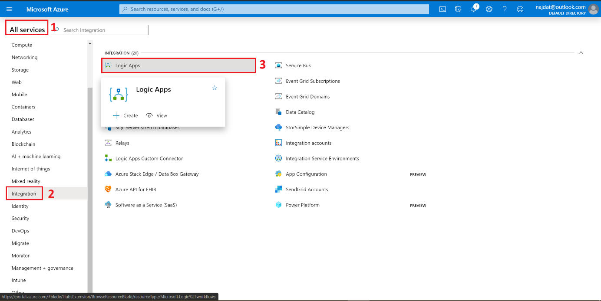
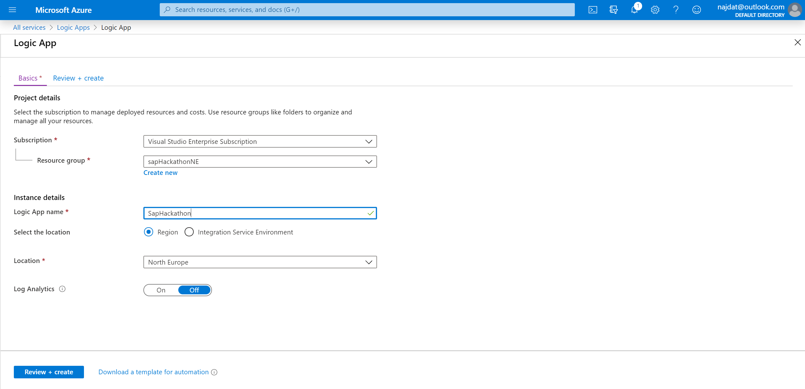
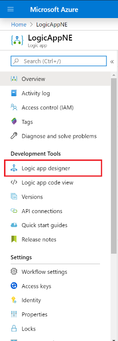
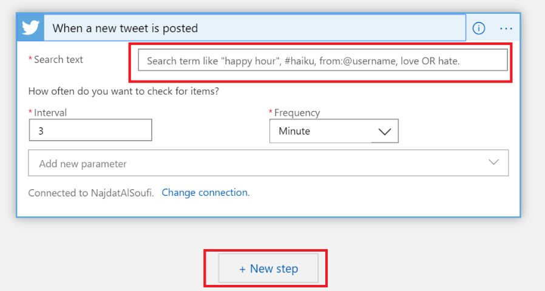
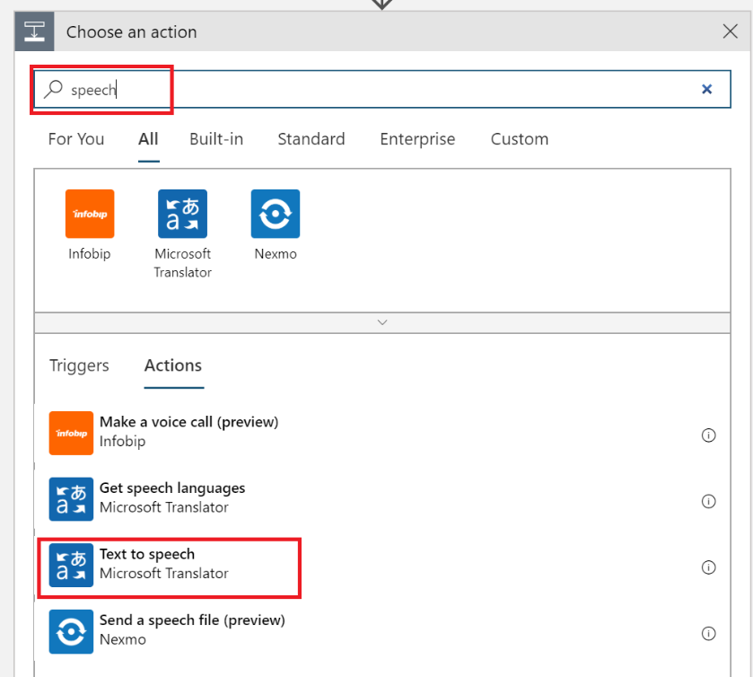
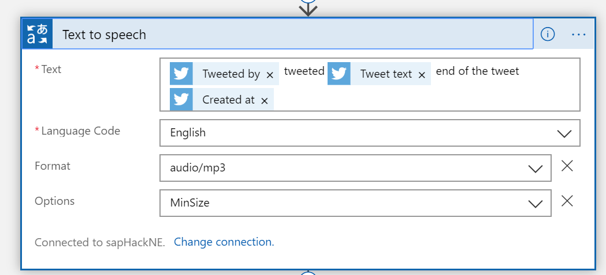
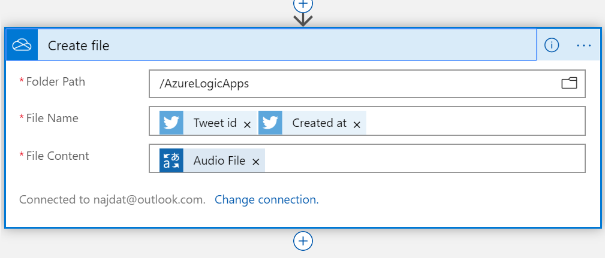
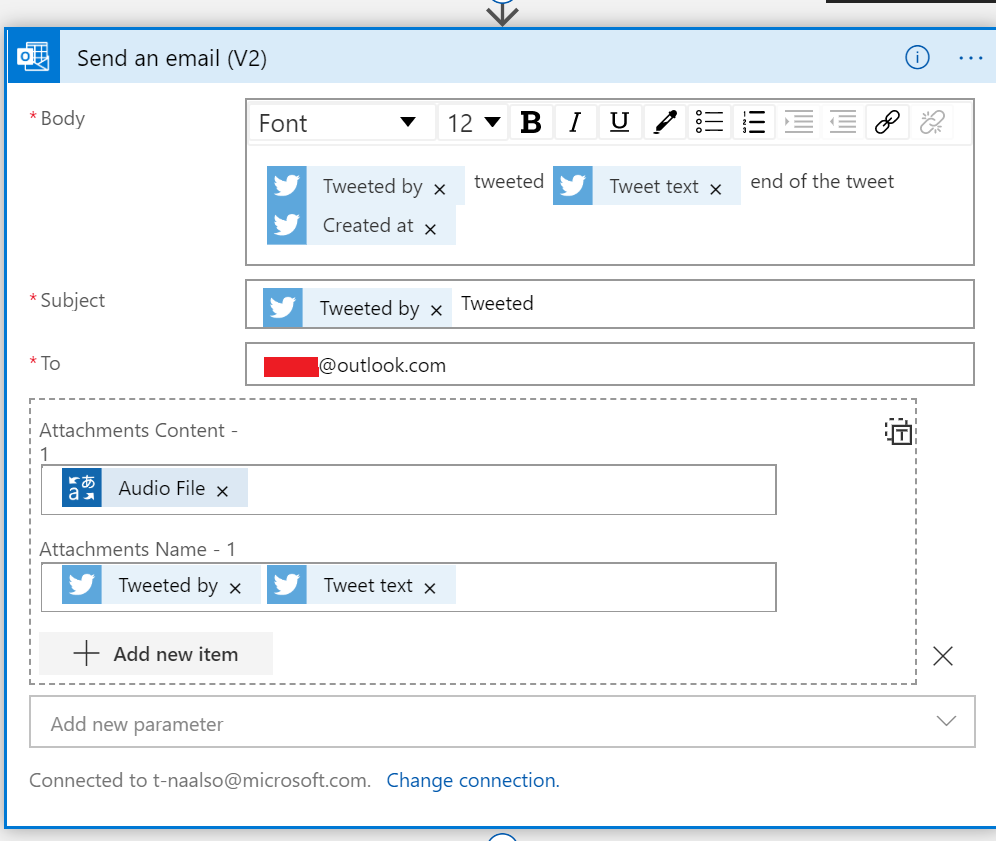
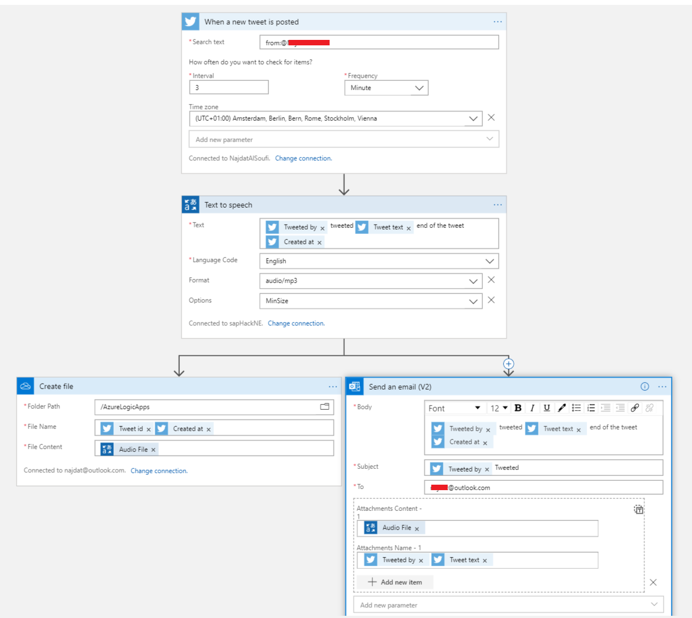

# Convert a tweet to speech and send it to an email or save it to OneDrive

## Prerequisites

Azure subscription,
Twitter account,
Email account,
Optional: OneDrive account

**Setting up**

Create a new logic App

All services -\> Integration -\> Logic Apps -\> Add

Chose the Subscription plan and the resource group (Click on Create new
if needed) then enter the desired Logic app name, chose the location
then click on Review + create -\> Create -\> Go to resource

From the side bar click on Logic App designer

In the search bar type Twitter then chose 'when a new Tweet is posted'

Fill in the needed search (case sensitive for the Hashtag \# and name
tag @ ) then click on New step

In the search bar type 'speech' then chose 'text to speech' (must have a
Speech cognitive service ready)

A new panel will open, chose the desired parameters for example

Then click on New step and either choose type 'OneDrive' or 'Send to
Email'

For one drive chose one drive connecter and log in to your account.
Chose folder that you would like to add the generated audio files into
and type the file name, in the file content chose Audio file

For email option chose Send an email and login to your email address
then fill in the needed fields while adding the audio file as an
attachment

Full scenario

